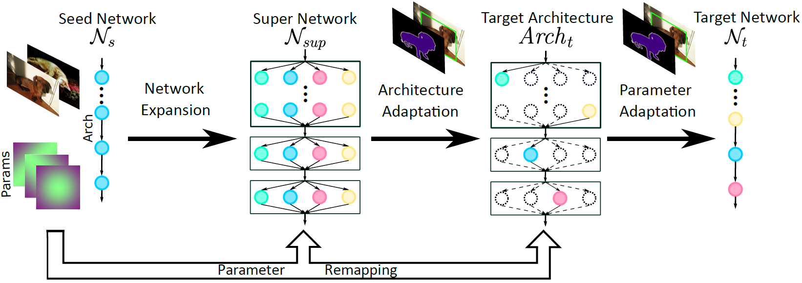
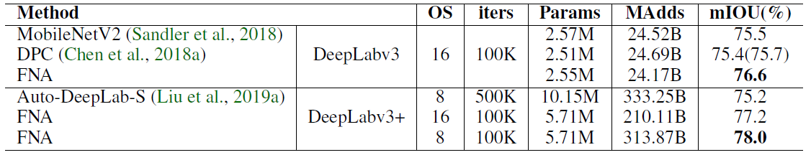
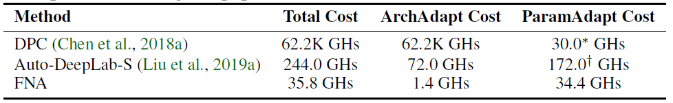
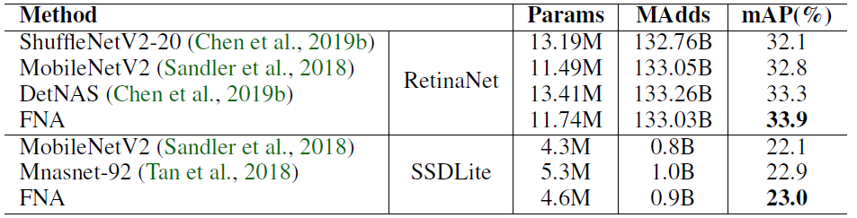
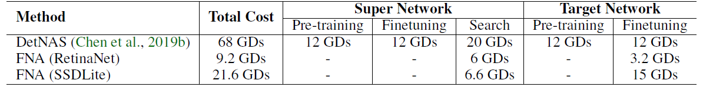

# FNA
The code of the ICLR 2020 paper [Fast Neural Network Adaptation via Parameter Remapping and Architecture Search](https://openreview.net/forum?id=rklTmyBKPH)

### Code coming soon!

Deep neural networks achieve remarkable performance in many computer vision tasks. Most state-of-the-art (SOTA) semantic segmentation and object detection approaches reuse neural network architectures designed for image classification as the backbone, commonly pre-trained on ImageNet. However, performance gains can be achieved by designing network architectures specifically for detection and segmentation, as shown by recent neural architecture search (NAS) research for detection and segmentation. One major challenge though, is that ImageNet pre-training of the search space representation (a.k.a.~super network) or the searched networks incurs huge computational cost. 

In this paper, we propose a Fast Neural Network Adaptation (FNA) method, which can adapt both the architecture and parameters of a seed network (e.g. a high performing manually designed backbone) to become a network with different depth, width, or kernels via a Parameter Remapping technique, making it possible to utilize NAS for detection/segmentation tasks a lot more efficiently.

## Results

In our experiments, we conduct FNA on MobileNetV2 to obtain new networks for both segmentation and detection that clearly out-perform existing networks designed both manually and by NAS. The total computation cost of FNA is significantly less than SOTA segmentation/detection NAS approaches: 1737$\times$ less than DPC, 6.8$\times$ less than Auto-DeepLab and 7.4$\times$ less than DetNAS.

